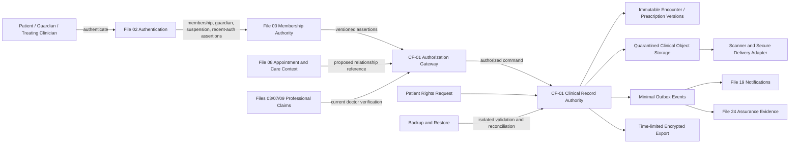

# C1-A Governance and Architecture Foundation

## 1. Governing decision

CF-01 is a conditional future system of record for highly sensitive clinical data. During C1-A, the repository defines and verifies the conditions for extraction; it does not create a live clinical database or process real patient data.

### Central law

**One clinical record authority — purpose-bound least privilege — immutable signed provenance — no autonomous prescription — no public clinical leakage.**

## 2. Canonical ownership

CF-01 may own, after activation approval:

- clinical patient compartment and clinical UUID;
- care relationships and purpose/scope lifecycle;
- clinical consent and guardian context;
- intake, history, observations, totality and clinician assessments;
- encounters, signatures, addenda and entered-in-error records;
- prescriptions, supersession, discontinuation and patient instructions;
- follow-up plans, patient-reported outcomes and longitudinal timeline;
- clinical attachments, access history, break-glass records;
- correction/export requests and clinical retention/legal-hold governance.

It must not duplicate public profiles, appointments, ordinary messages, public case publishing, AI/Radar studies, payment ledgers, global search or general media storage.

## 3. Future private routes — disabled during C1-A

| Route | Intended purpose | Mandatory privacy law |
|---|---|---|
| `/clinic/records` | Authenticated patient/clinician landing | noindex, no-store, relationship scoped |
| `/clinic/patients/{clinical_id}` | Clinician chart workspace | opaque ID, field authorization, existence protection |
| `/my-health-record` | Patient portal and rights requests | recent authentication for export |
| `/clinic/encounters/{id}` | Draft, sign and addendum | optimistic concurrency; signed core immutable |
| `/clinic/prescriptions/{id}` | Sign, view, supersede, discontinue | active treating relationship + clinician authority |
| `/clinic/follow-ups/{id}` | Questionnaire, outcome and plan | patient/clinician scoped |
| `/admin/clinical-governance` | retention, templates, access review, health | no blanket chart access; step-up and dual control |
| `/api/clinical/v1/*` | versioned commands and queries | strict scopes, no wildcard CORS, no shared cache |

No route in this table is authorized for runtime registration during C1-A.

## 4. Data-flow model

### Data-flow invariants

- Authentication is not authorization.
- Appointment context is not a clinical record.
- A message body is not a chart entry.
- A Radar/AI study is not an assessment or prescription.
- Notification and assurance systems receive minimized derivatives, not raw chart content.
- Backup restore must reconcile deletion, restriction, legal hold, consent and authorization before records become available.

## 5. Authorization constitution

Every protected action evaluates the following server-side tuple:

`actor + current session + capability + object + field + purpose + care relationship + consent + guardian/age + suspension + professional verification + entitlement + recent authentication + record state + expected version + rate/risk controls`

A missing, unknown or incompatible mandatory assertion fails closed. A visible button, role label, nonce, deep link, cached badge or provider availability never grants authority.

### Role boundaries

| Role | Permitted purpose | Prohibited boundary |
|---|---|---|
| Patient | own eligible record, consent, questionnaire, access history, correction/export | another patient, clinician signature, audit override |
| Guardian | verified minor context and approved fields | unrelated ward, adult record, authority beyond scope/expiry |
| Treating doctor | assigned active relationship; encounter, prescription and follow-up | unassigned patient, blanket search, identity evidence or finance |
| Clinical assistant | delegated intake, measurements and tasks | assessment, prescription, signature or break-glass |
| Clinical supervisor | authorized review/countersign/quality purpose | silent edit or unrelated charts |
| Records/privacy officer | rights, retention, transfer and access review | treatment decision or unrestricted narrative browsing |
| Break-glass clinician | short, minimum emergency view after step-up and reason | export, bulk access or persistent relationship |
| Auditor/security | masked metadata and control evidence | clinical content or keys by default |

## 6. Core integrity state machines

### Encounter

`Draft -> In Progress -> Ready to Sign -> Signed -> Addended / Entered in Error`

Signed clinical text is immutable. An addendum is separately authored, timestamped and linked. Entered-in-error never destroys history.

### Prescription

`Draft -> Validated -> Signed/Active -> Superseded/Discontinued/Expired -> Archived`

Only an authorized clinician may sign or change active status. Signed prescriptions are never edited in place.

### Follow-up

`Planned -> Due -> Patient Submitted -> Clinician Review -> Completed / Rescheduled / Cancelled / Overdue`

Patient input never changes treatment automatically.

### Break-glass

`Requested -> Step-Up Verified -> Granted (TTL) -> Used -> Expired/Revoked -> Retrospective Review -> Closed`

Break-glass provides minimum fields, no export, immediate audit and anomaly review.

## 7. Data classification and retention applicability

All chart records and clinical attachments are **C5 — Highly Sensitive Clinical**. Rights-case metadata may be C4/C5. During C1-A, retention periods remain **Not Assessed** until qualified professional and jurisdictional review. The system must not invent one global number.

The retention register must define, per category and jurisdiction:

- legal/professional basis;
- start event and duration;
- minor/guardian rule;
- litigation/professional hold;
- deletion/anonymization exception;
- provider and derivative purge duties;
- backup-expiry treatment;
- owner, reviewer, effective date and next review.

## 8. Threat model and mandatory controls

| Threat | Required control/evidence |
|---|---|
| Cross-patient IDOR/BOLA | opaque identifiers; relationship + object + field authorization on every request; negative matrix |
| Overbroad staff access | purpose roles, minimum views, step-up, access logs and anomaly review |
| Silent record alteration | immutable signed snapshot, addendum/supersession and stale-version rejection |
| Wrong-patient merge | high-confidence matching, quarantine, dual review and reversible links |
| Guardian abuse | verified scope, expiry, recheck and sensitive exceptions |
| Attachment malware/leak | C5 quarantine, MIME/hash validation, scanning, expiring URLs and no-store |
| Key loss/ransomware | managed separated keys, immutable backups and tested recovery |
| Break-glass misuse | verified clinician, reason, TTL, minimal fields, alert and retrospective review |
| AI/Radar auto-prescription | read-only reference contract; no clinical write scope; clinician signature |
| Notification disclosure | generic minimal templates and secure deep links |
| Retention violation | jurisdiction register, holds, due jobs and purge evidence |
| Restore resurrection | deletion ledger, tombstones and restore reconciliation before opening |

## 9. Integration boundaries

- **Files 00/02:** identity, guardian, suspension, role and recent-auth assertions; no credential copy.
- **Files 03/07/09:** professional identity and verification; action-time revalidation.
- **File 08:** appointment/clinic context; remains appointment owner.
- **Files 15/16:** educational references only; never write diagnosis or prescription.
- **File 17:** secure context link; message body remains outside the chart unless explicitly recorded through an authorized CF-01 command.
- **File 19:** minimal reminders and alerts; transport failure does not alter clinical truth.
- **Files 20/25:** private shell and visual/accessibility contracts; no public indexing or profile timeline.
- **File 24:** assurance, incident, risk and evidence aggregation; native clinical enforcement remains in CF-01.

## 10. C1-A exit checklist

C1-A is complete only when every item has retained evidence and an approver:

- [ ] qualified legal/professional applicability register;
- [ ] approved data-flow and trust-boundary diagram;
- [ ] reviewed threat model and abuse cases;
- [ ] frozen ownership and consumer contracts;
- [ ] role/purpose/field authorization matrix;
- [ ] guardian and minor lifecycle decision;
- [ ] retention, legal-hold, rights and breach-duty register;
- [ ] encryption, key, object-storage, scanner and backup architecture;
- [ ] named clinical/privacy/security operational owners;
- [ ] independent security review plan;
- [ ] requirements traceability matrix and test strategy;
- [ ] Founder phase-exit approval authorizing C1-B.
